# Next.js Official Tutorial Progress

### Етап 1: Getting Started

**Що зроблено:**
Ініціалізовано проект, використовуючи стартовий шаблон курсу Next.js Learn. Встановлено необхідні залежності (`npm install`) та запущено локальний сервер розробки командою `pnpm dev
`. Перевірено відображення стартової сторінки за адресою `localhost:3000`.

**Скріншот:**

**Мої думки/питання:**
Середовище налаштувалося швидко. Стартовий шаблон вже містить певний UI.
### Етап 2: CSS Styling

**Що зроблено:**
Додано глобальні стилі до застосунку. Я імпортував файл `/app/ui/global.css` у кореневий макет (`/app/layout.tsx`), щоб стилі застосовувалися до всіх сторінок. Також ознайомився з використанням Tailwind CSS для швидкої стилізації компонентів та бібліотекою `clsx` для умовного перемикання класів.

**Скріншот:**

**Мої думки/питання:**
Використання Tailwind значно пришвидшує верстку, оскільки не потрібно постійно перемикатися між файлами стилів. Глобальні стилі одразу змінили вигляд всього проєкту.
### Етап 3: Optimizing Fonts and Images

**Що зроблено:**
Налаштовано шрифти та зображення для оптимізації продуктивності:
1. Підключено Google Fonts (`Inter` для основного тексту та `Lusitana` для заголовків) через `next/font/google`. Це запобігає зсуву макета (CLS) під час завантаження шрифтів.
2. Додано логотип `AcmeLogo` та герой-зображення (Hero Images) за допомогою компонента `<Image>`.
3. Налаштовано відображення різних зображень для мобільних та десктопних пристроїв за допомогою CSS-класів (hidden/block).

**Скріншот:**

**Мої думки/питання:**
Компонент `<Image>` автоматично обробляє такі складні речі, як "lazy loading" та зміна розміру, що дуже зручно. Також цікаво, що шрифти завантажуються на сервері під час білду, а не клієнтом.
### Етап 4: Creating Layouts and Pages

**Що зроблено:**
Створено маршрутизацію (file-system routing) для панелі керування:
1. Створено сторінки `dashboard/page.tsx`, `dashboard/customers/page.tsx` та `dashboard/invoices/page.tsx`.
2. Створено файл `dashboard/layout.tsx` для спільного макету. Тепер бічна панель `<SideNav />` відображається на всіх сторінках дашборду.
3. Використано проп `children` у компоненті Layout, щоб автоматично підставляти контент поточної сторінки.

**Скріншот:**
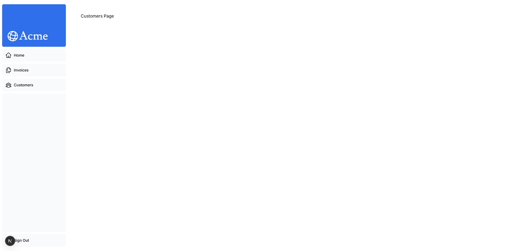

**Мої думки/питання:**
Головна перевага використання `layout.tsx` — це те, що при переході між сторінками перерендериться тільки контент (children), а бічна панель залишається статичною. Це економить ресурси та покращує UX.
### Етап 5: Navigating Between Pages

**Що зроблено:**
Оптимізовано навігацію в застосунку:
1. Замінено стандартні теги `<a>` на компонент `<Link>` з `next/link`. Це дозволяє переходити між сторінками миттєво без повного перезавантаження сторінки (client-side navigation).
2. Реалізовано патерн "Active Link" (активне посилання). За допомогою хука `usePathname()` я отримую поточний шлях URL і, використовуючи бібліотеку `clsx`, умовно додаю класи стилів, щоб підсвітити активну сторінку в меню.

**Скріншот:**
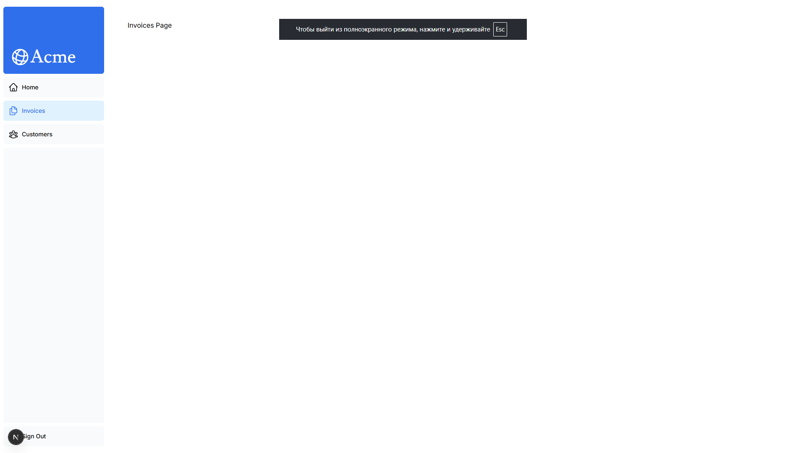

**Мої думки/питання:**
Дуже зручно, що Next.js автоматично розбиває код (code splitting) за маршрутами. Крім того, при наведенні на посилання `<Link>`, Next.js фоново передзавантажує код цільової сторінки, що робить перехід миттєвим.
### Етап 6: Setting Up Your Database

**Що зроблено:**
Налаштовано хмарну базу даних PostgreSQL (через Vercel Postgres):
1. Створено проект на Vercel та підключено базу даних.
2. Налаштовано змінні оточення у файлі `.env` для доступу до БД.
3. Використано скрипт `seed.js` для створення таблиць (users, customers, invoices, revenue) та наповнення їх початковими даними.
4. Перевірено з'єднання з базою, виконавши тестовий SQL-запит, який повернув дані з таблиці `invoices`.

**Скріншот:**
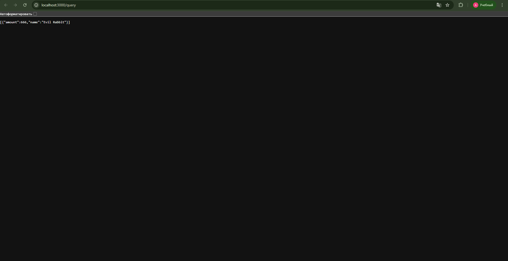

**Мої думки/питання:**
Цікаво, що Next.js дозволяє писати SQL-запити безпосередньо, використовуючи Vercel SDK. Скрипт seeding дуже корисний для розробки, бо дозволяє одразу працювати з наповненим інтерфейсом, а не пустими таблицями.
### Етап 7: Fetching Data

**Що зроблено:**
Налаштовано отримання реальних даних з бази даних PostgreSQL:
1. Компонент сторінки `Page` перетворено на асинхронний (`async`), що дозволяє використовувати `await` для запитів даних.
2. Використано функції `fetchRevenue`, `fetchLatestInvoices` та `fetchCardData` (з файлу `app/lib/data.ts`), які виконують SQL-запити до бази.
3. Видалено захардкоджені дані, тепер графіки та таблиці відображають актуальну інформацію з БД.
4. Розглянуто проблему "Request Waterfalls" (каскад запитів), коли один запит чекає виконання попереднього.

**Скріншоти:**
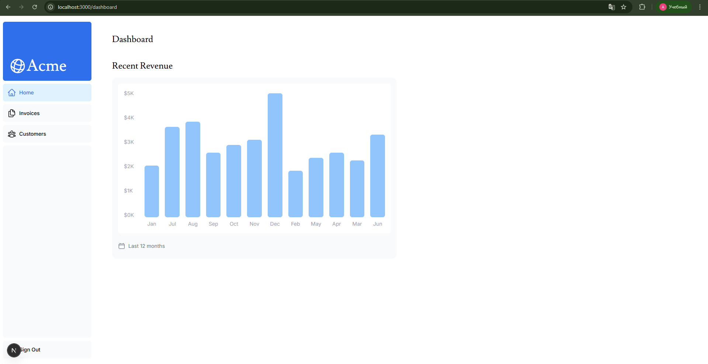
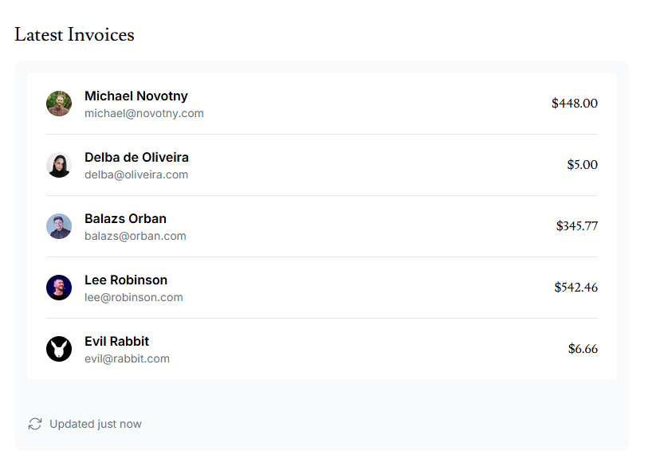
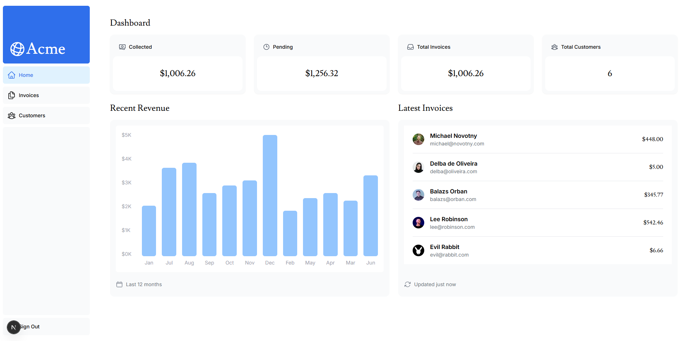

**Мої думки/питання:**
Це одна з найкрутіших фіч Next.js App Router — можливість писати SQL-запити прямо в компонентах (Server Components). Це безпечно, бо цей код виконується тільки на сервері і не потрапляє в браузер клієнта.
### Етап 8: Static and Dynamic Rendering

**Що зроблено:**
1. Ознайомився з різницею між статичним (Static) та динамічним (Dynamic) рендерингом.
2. Використовував `unstable_noStore` з `next/cache`, щоб вимкнути кешування даних і змусити сторінку рендеритися динамічно при кожному запиті.
3. Додав штучну затримку (`await new Promise(...)`) на 3 секунди у функцію `fetchRevenue`, щоб симулювати повільну мережу.
4. Переконався, що при динамічному рендерингу повільний запит блокує завантаження всієї сторінки.

**Скріншот:**
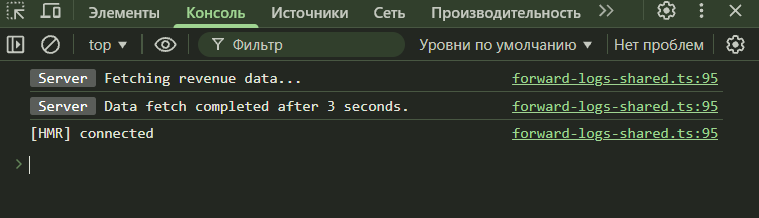

**Мої думки/питання:**
Динамічний рендеринг корисний, щоб бачити актуальні дані, але має недолік: якщо один запит до бази "тупить", користувач бачить білий екран. Потрібно знайти спосіб показувати частину сторінки одразу, не чекаючи решти.
### Етап 9: Streaming

**Що зроблено:**
Оптимізовано завантаження сторінки за допомогою Streaming:
1. Створено файл `loading.tsx` у папці `/app/dashboard`. Цей файл автоматично працює як обгортка React Suspense для всієї сторінки, показуючи "скелет" інтерфейсу під час завантаження даних.
2. Реалізовано потокову передачу для окремих компонентів. Я виніс логіку затримки та отримання даних безпосередньо в компоненти `<RevenueChart />` та `<LatestInvoices />`.
3. Обгорнув ці компоненти в `<Suspense>` з власними `fallback`. Тепер статичні частини сторінки завантажуються миттєво, а важкі графіки підвантажуються незалежно, не блокуючи інтерфейс.

**Скріншоти:**
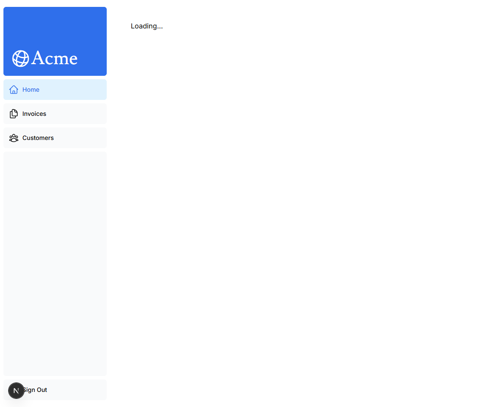
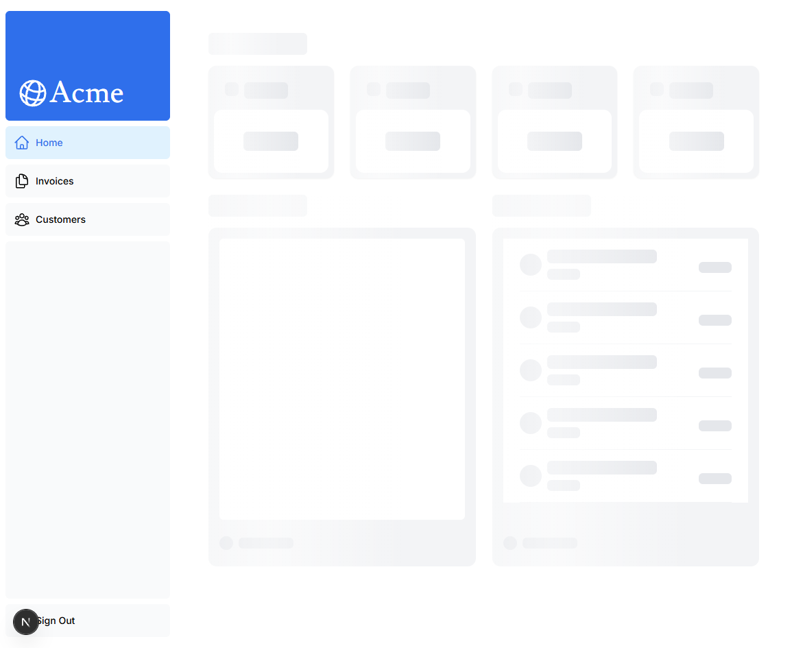
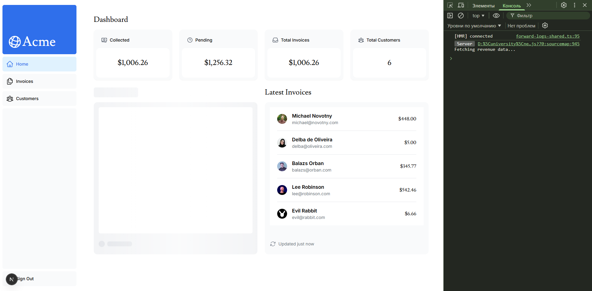

**Мої думки/питання:**
Стрімінг кардинально змінює UX. Замість білого екрану користувач одразу бачить структуру сайту. Дуже зручно, що можна керувати завантаженням кожного шматочка сторінки окремо через Suspense.
### Етап 10: Search and Pagination

**Що зроблено:**
Реалізовано функціонал пошуку та пагінації з використанням URL-параметрів замість локального стану (React state):
1. Використано хуки `useSearchParams`, `usePathname` та `useRouter` для оновлення URL при введенні пошукового запиту (наприклад, `?query=lee&page=1`). Це робить результати пошуку придатними для поширення (shareable).
2. Застосовано техніку **Debouncing** (через бібліотеку `use-debounce`), щоб зменшити кількість звернень до бази даних під час швидкого введення тексту користувачем.
3. Налаштовано компонент `<Pagination />` для відображення кнопок сторінок. Загальна кількість сторінок обчислюється на сервері на основі пошукового запиту.
4. Серверні компоненти (наприклад, таблиця інвойсів) тепер отримують `searchParams` як пропси та виконують відфільтровані SQL-запити.

**Скріншоти:**
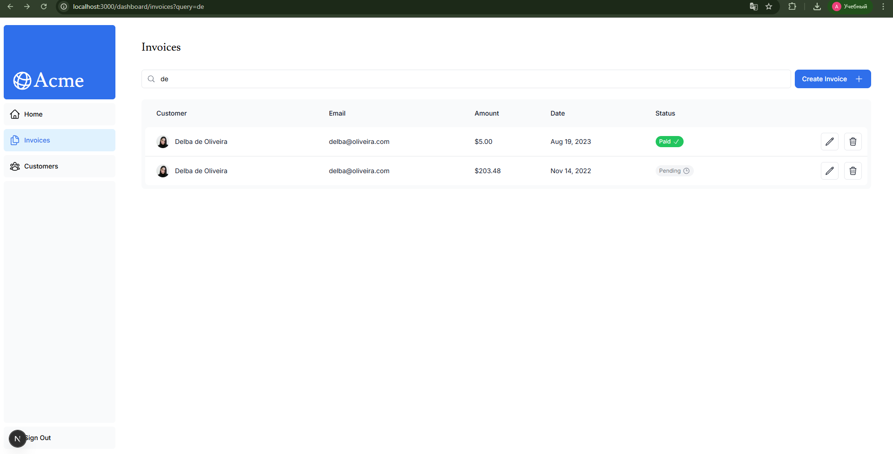
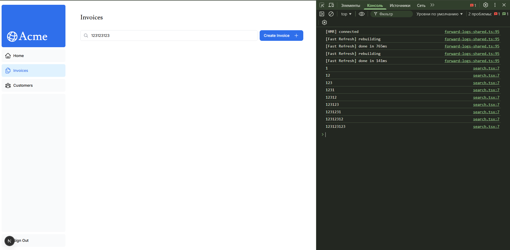
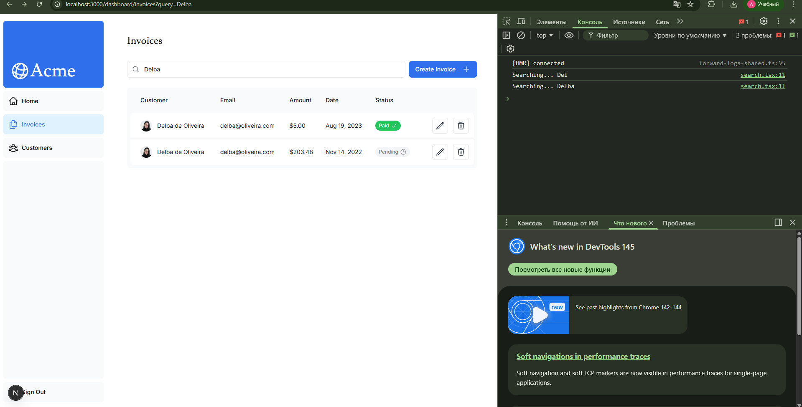
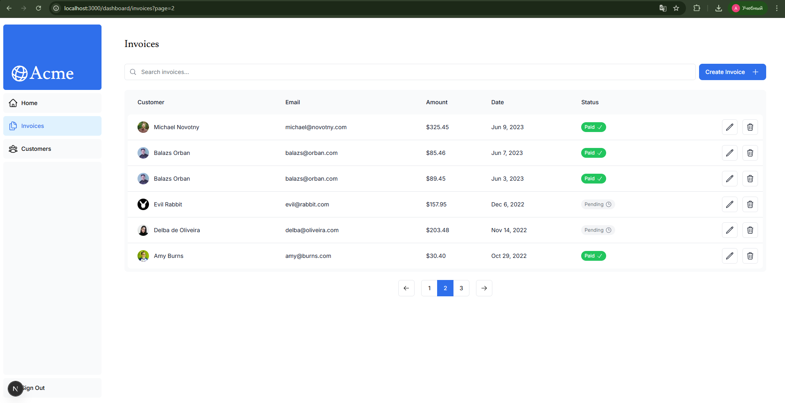

**Мої думки/питання:**
Зберігати стан пошуку в URL це дуже зручна практика. При оновленні сторінки фільтри не злітають. Debouncing також є критично важливим для оптимізації, щоб не перевантажувати базу даних запитами при кожному натисканні клавіші.
### Етап 11: Mutating Data

**Що зроблено:**
Реалізовано створення, оновлення та видалення інвойсів за допомогою React Server Actions:
1. **Server Actions:** Створено асинхронні функції (з директивою `'use server'`), які викликаються безпосередньо з HTML-форм. Це дозволяє уникнути створення окремих API-ендпоінтів.
2. **Створення (Create):** Налаштовано форму `/invoices/create`. Дані витягуються через `FormData`, сума конвертується в центи для уникнення помилок з плаваючою комою, після чого виконується SQL `INSERT`.
3. **Редагування (Update):** Створено динамічний маршрут `/invoices/[id]/edit`. Використано параметри URL для отримання конкретного інвойсу з БД та попереднього заповнення форми. Написано SQL `UPDATE`.
4. **Кешування та Навігація:** Використано функцію `revalidatePath('/dashboard/invoices')` для очищення кешу Next.js (щоб нові дані одразу з'явилися в таблиці) та `redirect()` для повернення користувача на сторінку списку інвойсів.

**Скріншоти:**
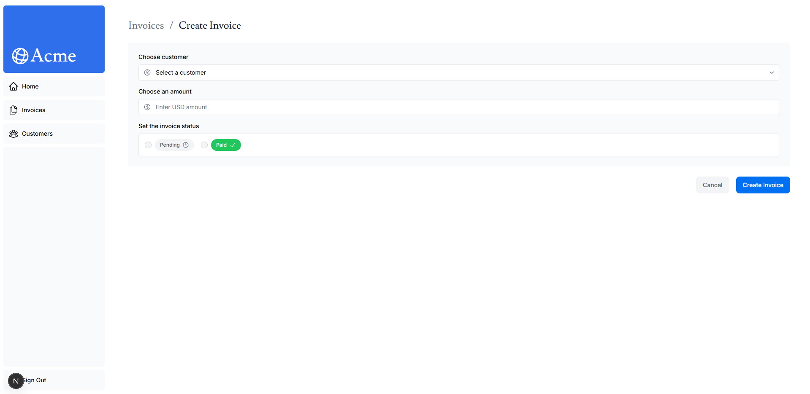
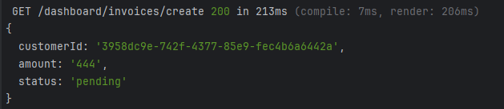

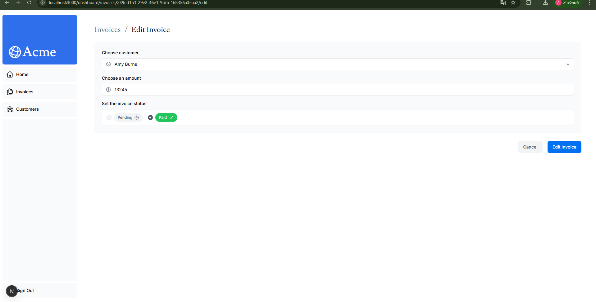
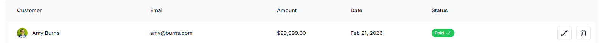

**Мої думки/питання:**
Server Actions значно спрощують роботу з формами. Раніше в React доводилося б створювати стани (`useState`) для кожного поля, писати `fetch` запит до API та вручну обробляти завантаження. Тепер форма працює майже як у класичному HTML, але з потужністю серверного коду.
### Етап 12: Handling Errors

**Що зроблено:**
Реалізовано "м'яку" обробку помилок за допомогою спеціальних файлів Next.js:
1. Створено файл `error.tsx`. Це клієнтський компонент (з директивою `'use client'`), який автоматично перехоплює непередбачувані помилки (наприклад, збій бази даних при видаленні інвойсу). Він відображає запасний UI з кнопкою "Try again", що дозволяє відновити роботу без перезавантаження всієї сторінки.
2. Створено файл `not-found.tsx` та використано функцію `notFound()` з `next/navigation`. Тепер, якщо запитати інвойс за неіснуючим ID (наприклад, підмінивши URL), Next.js замість системної помилки покаже акуратну кастомну сторінку 404 "Not Found".

**Скріншоти:**
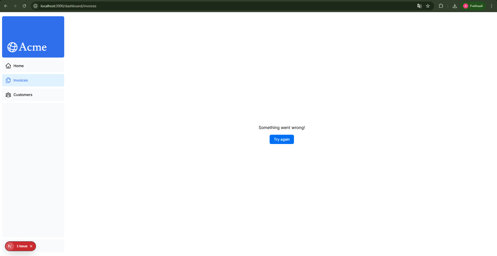
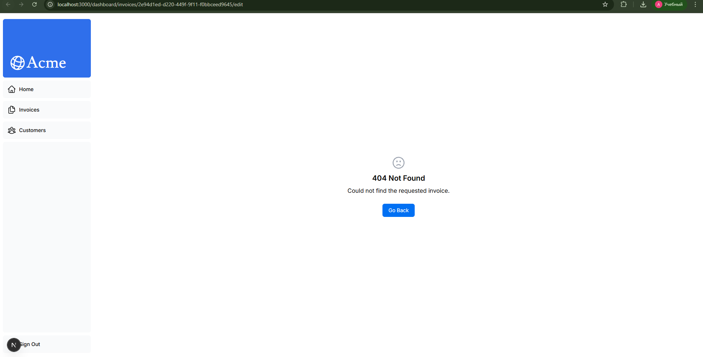

**Мої думки/питання:**
Дуже зручно, що Next.js дозволяє ізолювати помилки на рівні окремих сегментів маршруту. Якщо падає якась сторінка дашборду, бічна панель навігації залишається робочою, і користувач не відчуває, що весь сайт "зламався".
### Етап 13: Improving Accessibility

**Що зроблено:**
Покращено доступність (Accessibility) застосунку та додано серверну валідацію:
1. Використано бібліотеку `Zod` для опису схеми валідації даних на сервері перед їх відправкою до бази даних.
2. Застосовано хук `useActionState` (або `useFormState`), який дозволяє безпечно передавати помилки валідації з Server Action назад у клієнтський компонент форми.
3. Додано відображення конкретних повідомлень про помилки під кожним полем (наприклад, "Please select a customer").
4. Додано атрибути `aria-` (наприклад, `aria-describedby`), щоб зробити форму зрозумілішою для скрінрідерів.

**Скріншот:**
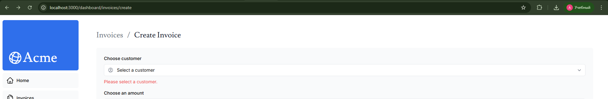

**Мої думки/питання:**
Раніше для валідації доводилося писати багато логіки на клієнті і окремо перевіряти дані на бекенді. Зв'язка `Zod` + Server Actions робить цей процес дуже надійним: навіть якщо користувач вимкне JavaScript у браузері, невалідні дані все одно не потраплять у базу.