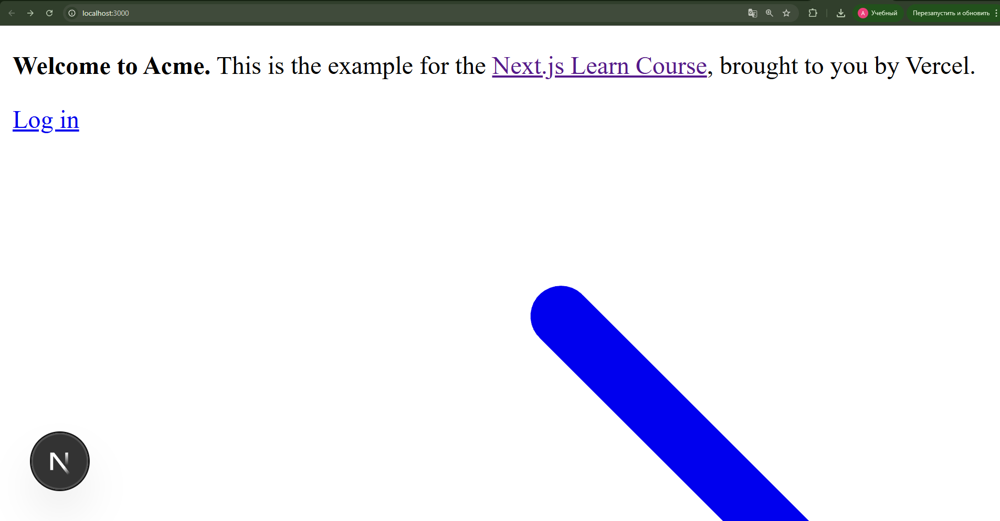
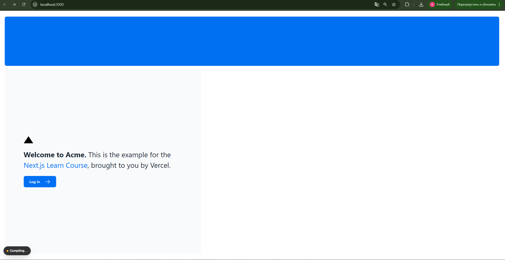
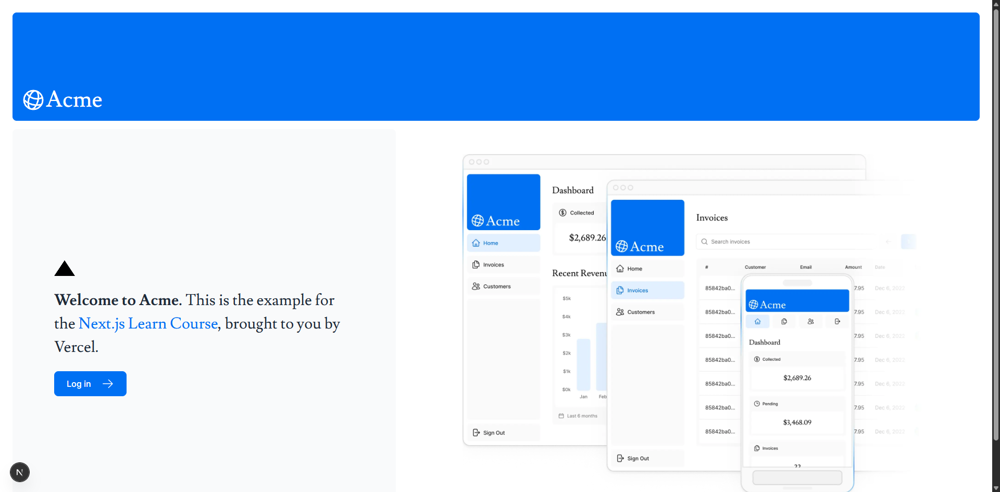

# Next.js Official Tutorial Progress

### Етап 1: Getting Started

**Що зроблено:**
Ініціалізовано проект, використовуючи стартовий шаблон курсу Next.js Learn. Встановлено необхідні залежності (`npm install`) та запущено локальний сервер розробки командою `pnpm dev
`. Перевірено відображення стартової сторінки за адресою `localhost:3000`.

**Скріншот:**

**Мої думки/питання:**
Середовище налаштувалося швидко. Стартовий шаблон вже містить певний UI.
### Етап 2: CSS Styling

**Що зроблено:**
Додано глобальні стилі до застосунку. Я імпортував файл `/app/ui/global.css` у кореневий макет (`/app/layout.tsx`), щоб стилі застосовувалися до всіх сторінок. Також ознайомився з використанням Tailwind CSS для швидкої стилізації компонентів та бібліотекою `clsx` для умовного перемикання класів.

**Скріншот:**

**Мої думки/питання:**
Використання Tailwind значно пришвидшує верстку, оскільки не потрібно постійно перемикатися між файлами стилів. Глобальні стилі одразу змінили вигляд всього проєкту.
### Етап 3: Optimizing Fonts and Images

**Що зроблено:**
Налаштовано шрифти та зображення для оптимізації продуктивності:
1. Підключено Google Fonts (`Inter` для основного тексту та `Lusitana` для заголовків) через `next/font/google`. Це запобігає зсуву макета (CLS) під час завантаження шрифтів.
2. Додано логотип `AcmeLogo` та герой-зображення (Hero Images) за допомогою компонента `<Image>`.
3. Налаштовано відображення різних зображень для мобільних та десктопних пристроїв за допомогою CSS-класів (hidden/block).

**Скріншот:**

**Мої думки/питання:**
Компонент `<Image>` автоматично обробляє такі складні речі, як "lazy loading" та зміна розміру, що дуже зручно. Також цікаво, що шрифти завантажуються на сервері під час білду, а не клієнтом.